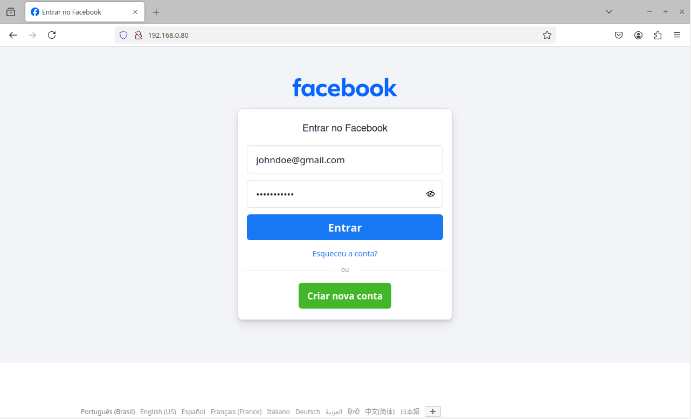
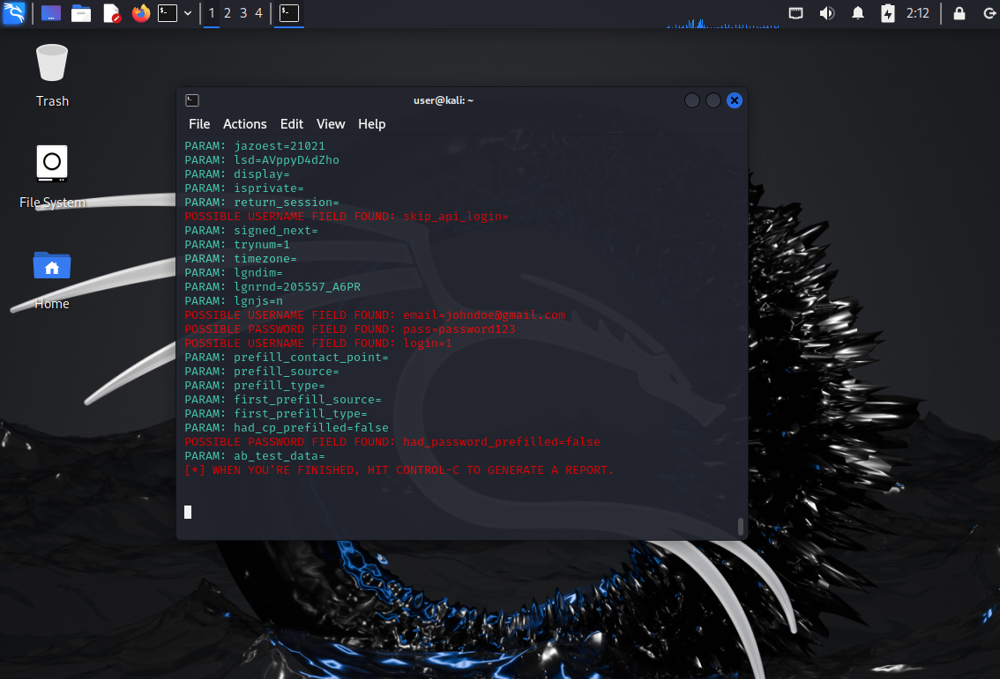

# Fishing para capturas de senha do Facebook

## Ferramentas utilizadas
- Kali Linux
- Setoolkit

## Etapas
1. Configurar ambiente Kali Linux (VM, por exemplo)
2. Abrir o terminal para executar os comandos abaixo via linha de comando
3. Acessar o setoolkit: `sudo setoolkit`
4. Escolher o tipo de ataque a ser realizado: `Social Engineering Attacks`
5. Escolher o vetor do ataque: `Web Site Attack Vectors`
6. Escolher o método do ataque: `Método de ataque` e `Site Cloner`
7. Obter o endereço IP da máquina: `ip a`. Observação: Se estiver em uma VM, importante lembrar de configurar a rede em modo Bridge.
8. Acessar em outra máquina na mesma rede o ip da máquina Kali. Ela estará servindo um site clonado.
9. Para a realização desse lab, foi escolhido criar um clone do facebook.com

## Resultado observado
- Foi possível acessar a página de fishing pelo ip da máquina Kali.

- Após tentar fazer login, recebi as informações interceptadas de usuário e senha.
